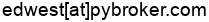

.. meta::
   :title: PyBroker
   :description: Algorithmic Trading in Python with Machine Learning

.. raw:: html

   

================
PyBroker
================

.. raw:: html

   <embed>
       &nbsp;
       &nbsp;
       &nbsp;
      
   </embed>

Algorithmic Trading in Python with Machine Learning
===================================================

**PyBroker** is a Python framework for backtesting algorithmic trading
strategies, including strategies that use machine learning. With PyBroker, it
is easy to write trading rules, build models, and analyze a strategy's
performance. And it is made fast with the help of `NumPy <https://numpy.org/>`_
and `Numba <https://numba.pydata.org/>`_ acceleration.

Some of PyBroker's key features are:

* Easy reuse of trading rules and models across multiple tickers.
* Model training and backtesting using `Walkforward Analysis <https://www.youtube.com/watch?v=WBZ_Vv-iMv4>`_.
* Extensive coverage of trading metrics, calculated out-of-sample.
* Robust performance metrics calculated with randomized `bootstrapping <https://en.wikipedia.org/wiki/Bootstrapping_(statistics)>`_.
* Support for downloading historical data from `Alpaca <https://alpaca.markets/>`_.
* Computing indicators in parallel for faster performance.
* Quicker development with caching of downloaded data, indicators, and trained models.

.. include:: install.rst

A Quick Example
===============

Code speaks louder than words! Here is a peek at what backtesting with PyBroker
looks like::

   import pybroker
   from pybroker import Alpaca, Strategy

   def train_fn(train_data, test_data, ticker):
      # Train the model using indicators stored in train_data.
      ...
      return trained_model

   # Register the model and its training function with PyBroker.
   my_model = pybroker.model('my_model', train_fn, indicators=[...])

   def exec_fn(ctx):
      preds = ctx.preds('my_model')
      # Open a long position given my_model's latest prediction.
      if not ctx.long_pos() and preds[-1] > threshold:
         ctx.buy_shares = 100
      # Close the long position given my_model's latest prediction.
      elif ctx.long_pos() and preds[-1] < threshold:
         ctx.sell_all_shares()

   alpaca = Alpaca(api_key=..., api_secret=...)
   strategy = Strategy(alpaca, start_date='1/1/2022', end_date='7/1/2022')
   strategy.add_execution(exec_fn, ['AAPL', 'MSFT'], models=my_model)
   # Run Walkforward Analysis on 1 minute data using 5 windows with 50/50 train/test data.
   result = strategy.walkforward(timeframe='1m', windows=5, train_size=0.5)

To learn how to use PyBroker, see the notebooks under the User Guide:

.. toctree::
   :maxdepth: 1
   :caption: User Guide

   Installation <install>
   notebooks/1. Getting Started with Data Sources
   notebooks/2. Backtesting a Strategy
   notebooks/3. Evaluating a Strategy using Bootstrap Metrics
   notebooks/4. Ranking and Position Sizing
   notebooks/5. Writing Indicators
   notebooks/6. Training a Model with Walkforward Analysis
   notebooks/7. Writing a Custom Data Source

`The notebooks above are also available on Github
<https://github.com/edtechre/pybroker/tree/master/docs/notebooks>`_.

.. toctree::
   :maxdepth: 4
   :caption: Reference

   Modules <reference/modules>
   Index <genindex>

Recommended Reading
===================

For more background on quantitative finance and algorithmic trading, below is a
list of essential books:

* Lingjie Ma, `Quantitative Investing: From Theory to Industry <https://www.amazon.com/Quantitative-Investing-Industry-Lingjie-Ma/dp/3030472019/>`_

* Timothy Masters, `Testing and Tuning Market Trading Systems: Algorithms in C++ <https://www.amazon.com/Testing-Tuning-Market-Trading-Systems/dp/148424172X/>`_

* Stefan Jansen, `Machine Learning for Algorithmic Trading, 2nd Edition <https://www.amazon.com/Machine-Learning-Algorithmic-Trading-alternative/dp/1839217715/>`_

* Ernest P. Chan, `Machine Trading: Deploying Computer Algorithms to Conquer the Markets <https://www.amazon.com/Machine-Trading-Deploying-Computer-Algorithms-ebook/dp/B01N7NKVG0/>`_

* Perry J. Kaufman, `Trading Systems and Methods, 6th Edition <https://www.amazon.com/Trading-Systems-Methods-Wiley-ebook/dp/B08141BBXR/>`_

.. toctree::
      :maxdepth: 1
      :caption: Other Information

      Changelog <changelog>
      License <license>

Contact
=======

