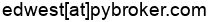

.. meta::
   :title: PyBroker
   :description: Algorithmic Trading in Python with Machine Learning
   :google-site-verification: XJpTXQaAdlEb2eAbndHa2ZmaUiOixSMaRusk-kKVKOQ

.. title:: Algorithmic Trading in Python with Machine Learning

.. raw:: html

   

.. raw:: html
   
   <section class="shields">
      
      
      
      
      
      
       
      
      
   </section>
  

Algorithmic Trading in Python with Machine Learning
===================================================

Are you looking to enhance your trading strategies with the power of Python and
machine learning? **PyBroker** is a Python framework
designed for developing algorithmic trading strategies, with a focus on
strategies that use machine learning. With PyBroker, you can easily create and
fine-tune trading rules, build powerful models, and gain valuable insights into
your strategy's performance.

Key Features
============

* A super-fast backtesting engine built in `NumPy <https://numpy.org/>`_ and accelerated with `Numba <https://numba.pydata.org/>`_.
* Easy creation of trading rules and models for executing across multiple instruments.
* Integration of trading signals across `multiple time intervals <https://www.pybroker.com/en/latest/notebooks/15.%20Multiple%20Time%20Intervals.html>`_, including daily, weekly, and monthly.
* Access to historical data from `Alpaca <https://alpaca.markets/>`_, `Yahoo Finance <https://finance.yahoo.com/>`_, `AKShare <https://github.com/akfamily/akshare>`_, or from `your own data provider <https://www.pybroker.com/en/latest/notebooks/7.%20Creating%20a%20Custom%20Data%20Source.html>`_.
* Model training and backtesting using `Walkforward Analysis <https://www.pybroker.com/en/latest/notebooks/6.%20Training%20a%20Model.html#Walkforward-Analysis>`_, which simulates how the strategy would perform during actual trading.
* Reliable trading metrics that use randomized `bootstrapping <https://en.wikipedia.org/wiki/Bootstrapping_(statistics)>`_ to provide more accurate results.
* `Parameter optimization <https://www.pybroker.com/en/latest/notebooks/12.%20Parameter%20Optimization.html>`_ with `Optuna <https://optuna.org/>`_ to select the best strategy parameters.
* `Caching <https://www.pybroker.com/en/latest/notebooks/1.%20Getting%20Started%20with%20Data%20Sources.html#Caching-Data>`_ of downloaded data, indicators, and models to speed up your development process.
* `Parallelized <https://www.pybroker.com/en/latest/notebooks/11.%20Configuring%20Parallelization.html>`_ computation and training for faster performance.
* :doc:`Agent Skills <agent-skills>` that help AI agents write trading strategies and backtests using PyBroker.

PyBroker provides you with the tools to build, test, and evaluate algorithmic trading strategies backed by machine learning.

.. include:: install.rst

A Quick Example
===============

Here's a glimpse of what backtesting with PyBroker looks like with these code
snippets:

**Rule-based Strategy**::

   from pybroker import Strategy, YFinance, highest

   def exec_fn(ctx):
      # Get the rolling 10 day high.
      high_10d = ctx.indicator('high_10d')
      # Buy on a new 10 day high.
      if not ctx.long_pos() and high_10d[-1] > high_10d[-2]:
         ctx.buy_shares = 100
         # Hold the position for 5 days.
         ctx.hold_bars = 5
         # Set a stop loss of 2%.
         ctx.stop_loss_pct = 2

   strategy = Strategy(YFinance(), start_date='1/1/2025', end_date='8/1/2026')
   strategy.add_execution(
      exec_fn, ['AAPL', 'MSFT'], indicators=highest('high_10d', 'close', period=10))
   # Run the backtest after 20 days have passed.
   result = strategy.backtest(warmup=20)

**Model-based Strategy**::

   import pybroker
   from pybroker import Alpaca, Strategy

   def train_fn(symbol, train_data, test_data):
      # Train the model using indicators stored in train_data.
      ...
      return trained_model

   # Register the model and its training function with PyBroker.
   my_model = pybroker.model('my_model', train_fn, indicators=[...])

   def exec_fn(ctx):
      preds = ctx.preds('my_model')
      if not ctx.long_pos() and preds[-1] > buy_threshold:
         ctx.buy_shares = 100
      elif ctx.long_pos() and preds[-1] < sell_threshold:
         ctx.sell_all_shares()

   alpaca = Alpaca(api_key=..., api_secret=...)
   strategy = Strategy(alpaca, start_date='1/1/2025', end_date='8/1/2026')
   strategy.add_execution(exec_fn, ['AAPL', 'MSFT'], models=my_model)
   # Run Walkforward Analysis on 1 minute data using 5 windows with 50/50 train/test data.
   result = strategy.walkforward(timeframe='1m', windows=5, train_size=0.5)

To learn how to use PyBroker, see the notebooks under the *User Guide*:

.. toctree::
   :maxdepth: 1
   :caption: User Guide

   Installation <install>
   notebooks/1. Getting Started with Data Sources
   notebooks/2. Backtesting a Strategy
   notebooks/3. Evaluating with Bootstrap Metrics
   notebooks/4. Ranking Long and Short Signals
   notebooks/5. Writing Indicators
   notebooks/6. Training a Model
   notebooks/7. Creating a Custom Data Source
   notebooks/8. Applying Stops
   notebooks/9. Rebalancing Positions
   notebooks/10. Rotational Trading
   notebooks/11. Configuring Parallelization
   notebooks/12. Parameter Optimization
   notebooks/13. Margin Trading
   notebooks/14. Modeling Slippage
   notebooks/15. Multiple Time Intervals
   notebooks/16. Time Series Models
   notebooks/17. Multi-Symbol Models
   notebooks/18. Dynamic Symbol Selection
   Agent Skills <agent-skills>
   notebooks/FAQs

`The notebooks above are also available on Github
<https://github.com/edtechre/pybroker/tree/master/docs/source/notebooks>`_.

AI Agent Skills
===============

PyBroker v2 now includes :doc:`AI agent skills <agent-skills>` for coding
agents:

* :ref:`Strategy Creator <skill-pybroker-strategy-creator>`
* :ref:`Indicator Creator <skill-pybroker-indicator-creator>`
* :ref:`Model Trainer <skill-pybroker-model-trainer>`
* :ref:`Parameter Optimization <skill-pybroker-optimize>`
* :ref:`Multi-Interval Strategies <skill-pybroker-multi-interval>`
* :ref:`Rotational Trading <skill-pybroker-rotational-trading>`

.. toctree::
   :maxdepth: 4
   :caption: Reference

   Configuration Options <reference/pybroker.config>

PyBroker reimplements standard indicators with volatility normalization and a
robust non-linear rescaling so their values are comparable across symbols and
market regimes.

.. toctree::
   :maxdepth: 2

   Indicators <reference/pybroker.indicator>

.. toctree::
   :maxdepth: 4

   Modules <reference/modules>

.. toctree::
   :maxdepth: 1

   Index <genindex>

Recommended Reading
===================

The following is a list of essential books that provide background information
on quantitative finance and algorithmic trading:

* Lingjie Ma, `Quantitative Investing: From Theory to Industry <https://www.amazon.com/Quantitative-Investing-Industry-Lingjie-Ma/dp/3030472019/>`_

* Timothy Masters, `Testing and Tuning Market Trading Systems: Algorithms in C++ <https://www.amazon.com/Testing-Tuning-Market-Trading-Systems/dp/148424172X/>`_

* Stefan Jansen, `Machine Learning for Algorithmic Trading, 2nd Edition <https://www.amazon.com/Machine-Learning-Algorithmic-Trading-alternative/dp/1839217715/>`_

.. toctree::
      :maxdepth: 1
      :caption: Other Information

      Benchmarking <benchmarking>
      Changelog <changelog>
      License <license>

Contact
=======

